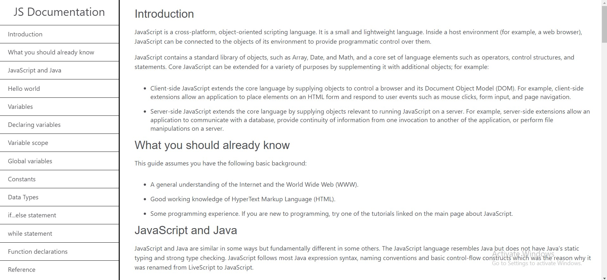
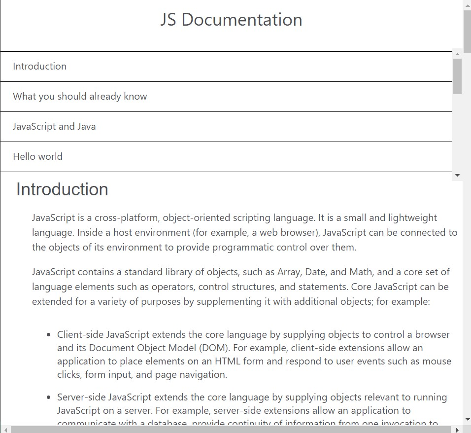

# Technical Documentation Website

This repository contains the source code for a technical documentation website built using HTML and CSS. The website provides detailed documentation on JavaScript topics.

## Table of Contents

- [Description](#description)
- [Features](#features)
- [Screenshots](#screenshots)
- [Installation](#installation)
- [Usage](#usage)
- [Contributing](#contributing)

## Description

This technical documentation website is designed to provide comprehensive information about JavaScript. It includes various sections with detailed explanations, code examples, and navigation features to make learning and reference easy.

## Features

- Navigation sidebar for easy access to different sections.
- Responsive design to adapt to various screen sizes.
- Smooth scrolling for a seamless user experience.
- Code formatting for code snippets within the documentation.

## Screenshots

## Installation

1. Clone the repository to your local machine:
2. Open the `index.html` file in your web browser to view the documentation.

## Usage

- Explore the documentation by clicking on the links in the navigation sidebar.
- Read detailed explanations and code examples on JavaScript topics.
- Use the website as a reference guide for JavaScript programming.

## Contributing

If you would like to contribute to this project, please follow these guidelines:

1. Fork the repository.
2. Create a new branch for your feature or bug fix.
3. Make your changes and test them thoroughly.
4. Commit your changes with descriptive commit messages.
5. Push your changes to your forked repository.
6. Create a pull request to the original repository.

##

Feel free to explore the technical documentation website and contribute to its improvement!
